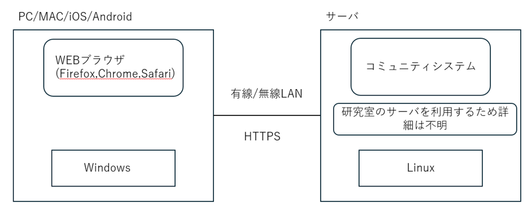
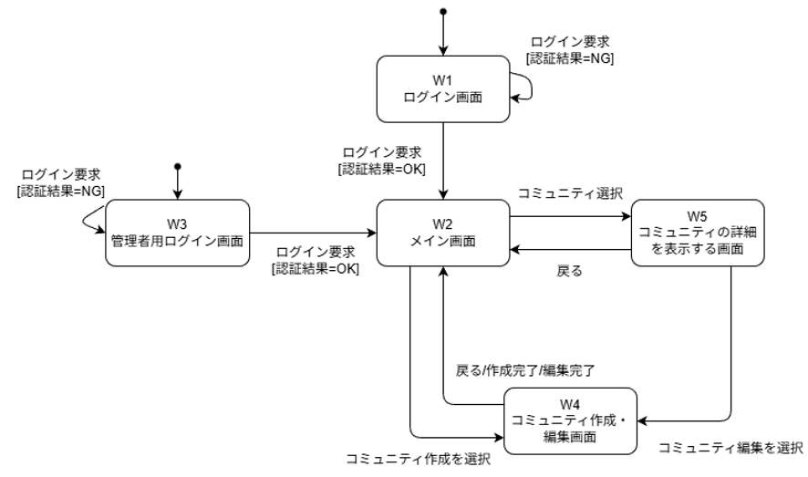
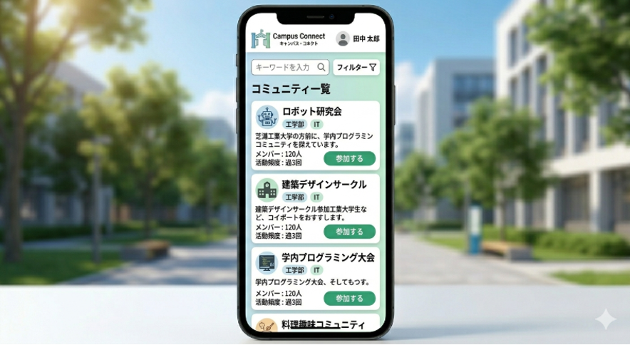
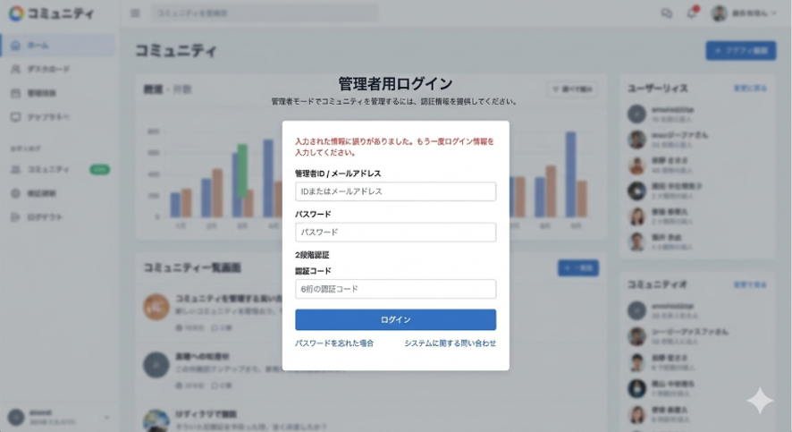
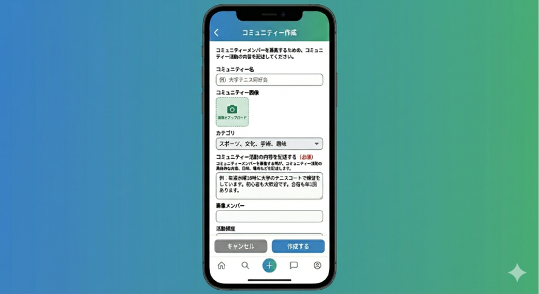
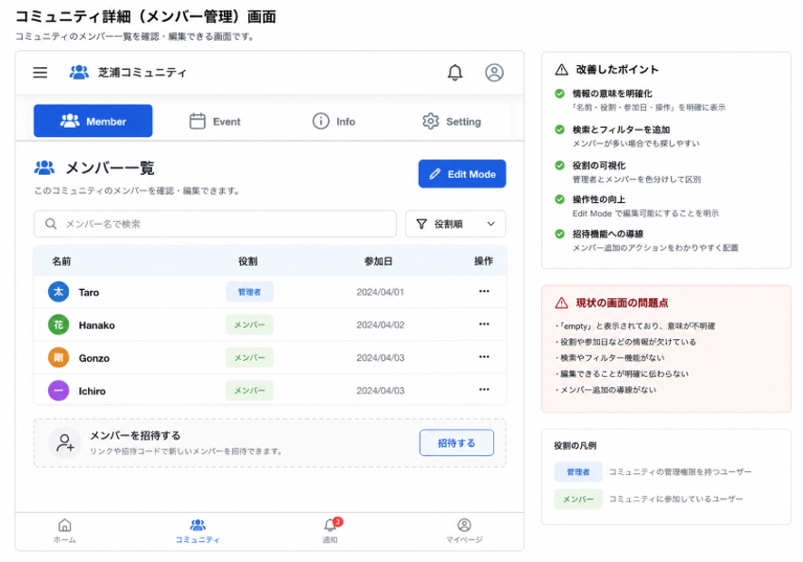

# コミュニティ活動を促進するコミュニティアプリ 外部設計書

* **改訂日:** 2026年5月26日
* **バージョン:** Ver. 2.1

---

## 目次
1. [システム概要](#1-システム概要)
2. [システム構成とソフトウェアの位置づけ](#2-システム構成とソフトウェアの位置づけ)
3. [各コンポーネントの機能](#3-各コンポーネントの機能)
4. [インタフェース仕様](#4-インタフェース仕様)
5. [画面仕様](#5-画面仕様)
6. [データ仕様](#6-データ仕様)
7. [改訂履歴](#7-改訂履歴)

---

## 1. システム概要

### 1.1 システムの目的
大学生向けに掲示板を提供し、コミュニティ（サークル等）の結成数向上（20%増）と初期コミュニケーションの時短（30%減）を実現すること。

### 1.2 対象ユーザ
大学内でコミュニティに参加、または作成したい大学生。

---

## 2. システム構成とソフトウェアの位置づけ

### 2.1 システム構成
 


* **サーバ:** 学内Linuxサーバ
* **連携ソフトウェア:** ミドルウェア、Webフレームワーク、データベース


### 2.2 ソフトウェア構成

#### コンポーネント構成図

本システムは、以下の主要コンポーネントおよびインタフェースで構成される。
 

#### コンポーネントに対する機能の割り当て
各ユースケースにおけるコンポーネント間の協調動作（シーケンス）は以下の通り定義する。

* **ユースケース一覧:**
  1. ログインする
  2. コミュニティ情報を閲覧する
  3. コミュニティの内容を編集・削除する
  4. 管理者アカウントにログインする
  5. コミュニティを新規記入する

---

## 3. 各コンポーネントの機能

### 3.1 C1 UI処理部

| 操作名 | 入力先とデータ | 処理内容 | 協調 | 出力先とデータ |
| :--- | :--- | :--- | :--- | :--- |
| **ログイン** | W1 ログイン画面<br>・メールアドレス<br>・パスワード<br>─────<br>C2 認証処理部<br>・認証成功/失敗M(OK/NG) | 認証処理部に認証要求し、OKならメイン画面へ移動する。NGなら認証失敗画面を表示する。 | C2 認証処理部 | C2 認証処理部<br>・認証要求<br>─────<br>[OK] W2 メイン画面<br>・画面表示<br>[NG] W1 ログイン画面<br>・認証失敗M |
| **管理者アカウントログイン** | W3 管理者用ログイン画面<br>・メールアドレス<br>・パスワード<br>─────<br>C2 認証処理部<br>・認証成功/失敗M(OK/NG) | 認証処理部に管理者権限認証要求をし、OKならメイン画面へ移動する。NGなら管理者用ログイン画面にその旨を表示する。 | C2 認証処理部 | C2 認証処理部<br>・管理者権限認証要求<br>─────<br>[OK] W2 メイン画面<br>・画面表示<br>[NG] W3 管理者用ログイン画面<br>・認証失敗M |
| **コミュニティを削除する** | W5 コミュニティの詳細を表示する画面<br>・選択中コミュニティの削除ボタン押下<br>─────<br>C3 コミュニティ活動処理部<br>・削除完了M | 削除ボタンを押下されたコミュニティの削除要求をC3 コミュニティ活動処理部に送信する。削除完了Mがユーザに確認されたのち、W2 メイン画面に遷移する。 | C3 コミュニティ活動処理部 | C3 コミュニティ活動処理部<br>・削除要求<br>─────<br>W5 コミュニティの詳細を表示する画面<br>・削除完了M<br>W2 メイン画面<br>・画面表示 |
| **コミュニティ詳細を開く** | W2 メイン画面 (コミュニティ一覧)から詳細を見たいコミュニティをタップ<br>─────<br>C3 コミュニティ活動処理部<br>・コミュニティ情報 | 選択したコミュニティのIDをC3に送信し、対応するコミュニティの詳細画面を表示する。 | C3 コミュニティ活動処理部 | C3 コミュニティ活動処理部<br>・コミュニティ情報取得要求<br>─────<br>W5 コミュニティの詳細を表示する画面<br>・画面表示 |
| **コミュニティ作成画面を開く** | W2 メイン画面<br>・コミュニティ作成ボタンを押す | コミュニティ作成ボタンが入力されたら、コミュニティ作成画面を表示する。 | なし | W4 コミュニティ作成<br>・画面表示 |
| **コミュニティ編集画面を開く** | W5 コミュニティの詳細を表示する画面<br>・「編集」ボタン押下<br>─────<br>C3 コミュニティ活動処理部<br>・コミュニティ情報 | C3 コミュニティ活動処理部に選択されているコミュニティの情報の取得を要求し、取得した情報を編集可能な形式で表示する。 | C3 コミュニティ活動処理部 | C3 コミュニティ活動処理部<br>・コミュニティ情報取得要求<br>─────<br>W4 コミュニティ作成・編集画面<br>・画面表示 |
| **メイン画面を開く** | C1 UI処理部<br>・メイン画面の表示要求<br>・利用者のユーザID<br>─────<br>C3 コミュニティ活動処理部<br>・コミュニティ情報 | F2 コミュニティ情報に存在するコミュニティ情報の内何件かの取得を要求し、取得した情報をメイン画面上に表示する。コミュニティ情報の取得要求の際、利用者のユーザIDを送信し、利用者が作成したコミュニティ情報を取得し、これを別途メイン画面に表示する。 | C3 コミュニティ活動処理部 | C3 コミュニティ活動処理部<br>・コミュニティ情報取得要求<br>・利用者のユーザID<br>─────<br>W2 メイン画面<br>・画面表示 |
| **条件指定してコミュニティを表示する** | W2 メイン画面<br>・条件<br>─────<br>C3 コミュニティ活動処理部<br>・コミュニティ情報 | W2 メイン画面からキーワード検索または絞り込み検索が要求された場合、入力された条件に合うコミュニティのみをW2 メイン画面に表示する。 | C3 コミュニティ活動処理部 | C3 コミュニティ活動処理部<br>・コミュニティ情報取得要求<br>・条件<br>─────<br>W2 メイン画面<br>・画面更新 |
| **コミュニティの作成・編集内容を保存する** | W4 コミュニティ作成・編集画面<br>・コミュニティ編集情報<br>─────<br>C3 コミュニティ活動処理部<br>・保存完了M | W4 コミュニティ作成・編集画面にて編集した内容をC3 コミュニティ活動処理部に送信し、保存を要求する。保存できたことが確認できた場合、画面に保存完了Mを表示する。 | C3 コミュニティ活動処理部 | C3 コミュニティ活動処理部<br>・コミュニティ編集情報<br>─────<br>W4 コミュニティ作成・編集画面<br>・保存完了M |

### 3.2 C2 認証処理部

| 操作名 | 入力先とデータ | 処理内容 | 協調 | 出力先とデータ |
| :--- | :--- | :--- | :--- | :--- |
| **Gmail認証リクエスト** | C1 UI処理部<br>・認証要求<br>─────<br>Gmail認証<br>・認証結果(OK/NG) | Gmailアカウントの認証を行い、認証結果(OK/NG)を返す。 | Gmail認証 | [OK] C1 UI処理部<br>・認証成功通知<br>F1 ログイン情報<br>・Gmailアドレス<br>・認証トークン<br>[NG] C1 UI処理部<br>・認証失敗通知 |
| **管理者権限認証** | C1 UI処理部<br>・管理者権限認証要求 | データベースにアクセスして管理者権限の認証を行い、認証結果(OK/NG)を返す。 | F1 ログイン情報 | [OK] C1 UI処理部<br>・認証成功通知<br>[NG] C1 UI処理部<br>・認証失敗通知 |

### 3.3 C3 コミュニティ活動処理部

| 操作 | 入力先とデータ | 処理 | 協調 | 出力 |
| :--- | :--- | :--- | :--- | :--- |
| **コミュニティ情報を取得する** | C1 UI処理部<br>・コミュニティ情報取得要求<br>・条件<br>─────<br>F2 コミュニティ情報<br>・コミュニティ情報 | C1 UI処理部からのコミュニティ情報取得要求に応じてコミュニティ情報をF2 コミュニティ情報から取得する。条件がnullの場合、事前に決めた条件(日付順など)で数十件取得する。 | F2 コミュニティ情報 | F2 コミュニティ情報<br>・SELECT<br>─────<br>C1 UI処理部<br>・コミュニティ情報 |
| **コミュニティ情報を保存する** | C1 UI処理部<br>・コミュニティ情報<br>─────<br>F2 コミュニティ情報<br>・保存完了M | C1 UI処理部からのコミュニティ情報をF2 コミュニティ情報に保存する。 | F2 コミュニティ情報 | F2 コミュニティ情報<br>・UPDATE<br>─────<br>C1 UI処理部<br>・保存完了M |
| **コミュニティを削除する** | C1 UI処理部<br>・コミュニティ削除要求<br>・コミュニティID<br>─────<br>F2 コミュニティ情報<br>・削除完了M | C1 UI処理部からのコミュニティ削除要求を受け、指定されたコミュニティIDのコミュニティをF2 コミュニティ情報から削除（論理削除）する。 | F2 コミュニティ情報 | F2 コミュニティ情報<br>・DELETE<br>─────<br>C1 UI処理部<br>・削除完了M |

---

## 4. インタフェース仕様

### 4.1 共通仕様
* **通信プロトコル:** HTTPS
* **データ表現形式:** JSON (`application/json`)
* **認証方式:** ログイン成功以降のリクエストは、HTTPヘッダーに Bearer トークン（JWT）を付与する。
  ```http
  Authorization: Bearer <JWT_TOKEN>


## 4.2 インタフェース一覧

| インタフェース名 | 記述 | 関連コンポーネント |
| :--- | :--- | :--- |
| **I1一般ユーザーログイン認証要求** | ユーザからのログイン要求を受け付け、外部のGmail認証トークンの検証を行う。認証が成功した場合は、以降の通信で使用するセキュリティトークン（Bearerトークン）を発行して返却する。 | C1 UI処理部 → C2 認証処理部 |
| **I1管理者ログイン認証要求** | 管理者からのログイン要求を受け付け、アカウントの検証を行う。 | C1 UI処理部 → C2 認証処理部 |
| **I2 コミュニティ一覧情報取得** | 現在システム内に登録されているコミュニティの一覧データを取得する。リクエストの際には、有効なセキュリティトークンによる認可チェックが行われる。 | C1 UI処理部 → C3 コミュニティ活動処理部 |
| **I3 コミュニティ詳細情報取得** | 指定された特定のコミュニティに関する詳細な情報（説明文や作成日時など）を取得する。リクエストの際には、有効なセキュリティトークンによる認可チェックが行われる。 | C1 UI処理部 → C3 コミュニティ活動処理部 |
| **I4 新規コミュニティ登録要求** | 画面に入力された情報をもとに、新しいコミュニティをシステムに登録する。セキュリティトークンから送信者のユーザ情報を識別し、作成者として紐づけを行う。 | C1 UI処理部 → C3 コミュニティ活動処理部 |
| **I5 コミュニティ情報変更要求** | 指定された既存コミュニティの登録内容（名前や説明など）を、編集された新しい内容で上書き更新する。リクエストの際には、編集権限の有無をチェックする。 | C1 UI処理部 → C3 コミュニティ活動処理部 |

### 4.3 各インタフェースの仕様詳細

#### (ア) I1一般ユーザーログイン認証要求
本システムのUI処理部（Webブラウザ）とサーバ側の各処理部間の通信仕様である。
* **主なAPIエンドポイント:**
  * `POST /auth/login` (Gmail認証トークンの検証とセッション確立)

#### (イ) I1管理者ログイン認証要求
本システムのUI処理部（Webブラウザ）とサーバ側の各処理部間の通信仕様である。
* **主なAPIエンドポイント:**
  * `POST /admin/auth/login` (管理者アカウント検証とセッション確立)

#### (ウ) I2コミュニティ一覧情報取得
本システムのUI処理部（Webブラウザ）とサーバ側の各処理部間の通信仕様である。
* **主なAPIエンドポイント:**
  * `GET /communities` (検索・一覧取得)

#### (エ) I3コミュニティ詳細情報取得
本システムのUI処理部（Webブラウザ）とサーバ側の各処理部間の通信仕様である。
* **主なAPIエンドポイント:**
  * `GET /communities/{id}` (詳細情報の取得)

#### (オ) I4新規コミュニティ登録要求
本システムのUI処理部（Webブラウザ）とサーバ側の各処理部間の通信仕様である。
* **主なAPIエンドポイント:**
  * `POST /communities` (新規作成)

#### (カ) I5コミュニティ情報変更要求
本システムのUI処理部（Webブラウザ）とサーバ側の各処理部間の通信仕様である。
* **主なAPIエンドポイント:**
  * `PUT /communities/{id}` (内容編集)

---

## 5. 画面仕様

### 5.1 画面一覧

| 画面名 | 画面内容 | 所属コンポーネント |
| :--- | :--- | :--- |
| **W1 ログイン画面** | ログイン入力を行う画面 | C1 UI処理部 |
| **W2 メイン画面** | コミュニティ一覧画面 | C1 UI処理部 |
| **W3 管理者用ログイン画面** | 管理者のログイン入力を行う画面 | C1 UI処理部 |
| **W4 コミュニティ作成・編集画面** | コミュニティの内容を記述する画面 | C1 UI処理部 |
| **W5 コミュニティの詳細を表示する画面** | コミュニティ一覧から見たいコミュニティを選んだ時に出てくる、コミュニティの詳細 | C1 UI処理部 |

### 5.2 画面の遷移
 

### 5.3 各画面のレイアウト
* **W1 ログイン画面**
* **W2 メイン画面**
* **W3 管理者用ログイン画面**
* **W4 コミュニティ作成・編集画面**
* **W5 コミュニティの詳細を表示する画面**

 
 
  
 


---

## 6. データ仕様

### F1 ユーザ情報
#### (1) データ内容

| 項目名 | 主キー | 記述 | 型 | 範囲 |
| :--- | :---: | :--- | :--- | :--- |
| **ユーザID** | ○ | ユーザを識別する番号 | 整数 | >0 |
| **メールアドレス** |  | 学内Gmailアドレス | 文字列 | <256バイト |
| **権限** |  | 一般ユーザ・管理者の区別 | 文字列 | `user` / `admin` |
| **作成日時** |  | 初回登録日時 | 日時 | 日時形式 |

#### (2) 物理的位置
`[学内]`Linuxサーバ上のDBに格納する。DBMS名およびDB名はサーバ仕様決定後に確定する（TBD）。テーブル名は `users` とする。

### F2 コミュニティ情報
#### (1) データ内容

| 項目名 | 主キー | 記述 | 型 | 範囲 |
| :--- | :---: | :--- | :--- | :--- |
| **コミュニティID** | ○ | コミュニティ情報を識別する番号 | 整数 | >0 |
| **作成者ユーザID** |  | 情報を新規記入したユーザ | 整数 | F1のユーザIDに準拠 |
| **コミュニティ名** |  | コミュニティの名称 | 文字列 | <100バイト |
| **カテゴリ** |  | 活動ジャンル | 文字列 | <64バイト |
| **概要** |  | 一覧に表示する短い説明 | 文字列 | <512バイト/空可 |
| **コミュニティ内容** |  | 活動内容，募集条件，連絡先，連絡方法などをまとめた本文 | 文字列 | <4000バイト |
| **画像保存パス** |  | 登録画像のサーバ上の保存先 | 文字列 | <512バイト/空可 |
| **画像形式** |  | 画像ファイル形式 | 文字列 | `jpg` / `png` / 空可 |
| **画像ファイルサイズ** |  | 画像ファイルの大きさ | 整数 | >0 かつ <5MB / 空可 |
| **公開状態** |  | 一覧や詳細画面への表示状態 | 文字列 | `公開` / `非公開` / `削除` |
| **作成日時** |  | コミュニティ情報の作成日時 | 日時 | 日時形式 |
| **更新日時** |  | コミュニティ情報の最終更新日時 | 日時 | 日時形式 |

#### (2) 物理的位置
コミュニティ情報は`[学内]`Linuxサーバ上のDBに格納する。DBMS名およびDB名はサーバ仕様決定後に確定する（TBD）。テーブル名は `communities` とする。画像ファイルを登録する場合，画像本体は`[学内]`Linuxサーバ上のファイル領域に格納し，保存パス等を本データ内に保持する。

※募集状態は独立項目として保持せず，募集の有無や連絡先は「コミュニティ内容」に記入する。削除は物理削除ではなく，公開状態を「削除」に更新する方式（論理削除）を想定する。

---

## 7. 改訂履歴

| バージョン | 改訂日 | 改訂内容 |
| :--- | :--- | :--- |
| 1.0 | 2026.5.12 | 初版発行 |
| 2.0 | 2026.5.19 | 内容を大幅に改訂 |
| 2.1 | 2026.5.26 | ・不足していたシーケンス図を追加<br>・画面のうち管理者用メイン画面を削除（機能的にメイン画面と統合予定）<br>・画面遷移図を編集、および固有組織情報の匿名化処理 |