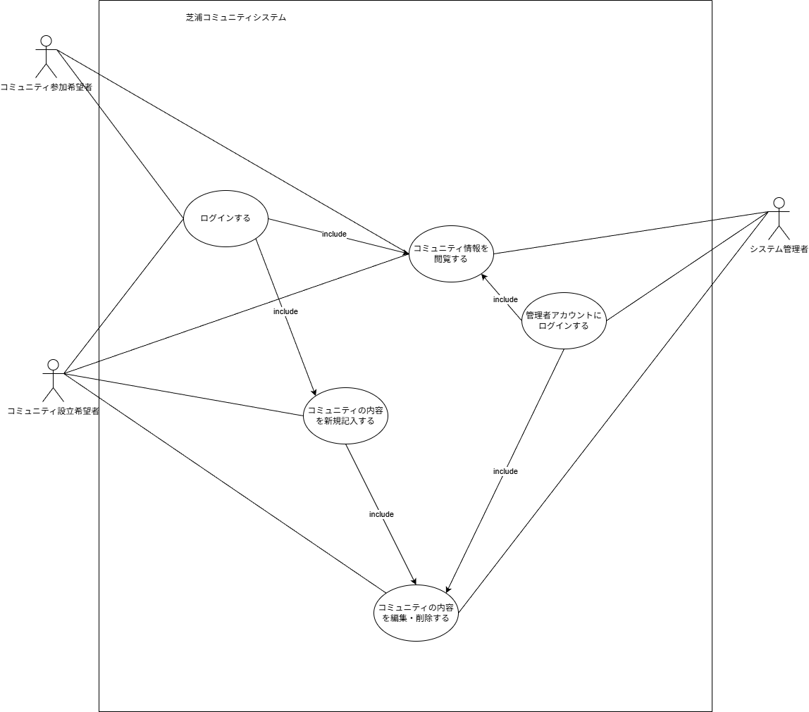

# コミュニティ活動を促進するコミュニティアプリ 要求仕様書

* **バージョン:** Ver.3.0
* **改訂日:** 2026年5月19日

---

## 1. 本仕様書の位置づけと範囲
本仕様書は、「大学生のコミュニティ活動を促進するコミュニティアプリ」の要求仕様を記述したものであり、本システムのソフトウェア外部設計に必要な情報の提供をするものである。

---

## 2. システムの目的

### 2.1 システム開発の目的
本システムは、コミュニティ形成の機会を十分に得られていない大学生、特に特定の大学の学生に対して、従来のSNSやマッチングプラットフォームと比べて掲示板機能に特化したサービスを提供することで、サークル活動や共同開発チームの結成数を20%向上させるとともに、初期コミュニケーションに要する時間を30%削減することを目的とする（※数字は仮）。

### 2.2 使用対象者と用途
本システムは以下のユーザが、以下の用途で利用することを想定する。

* **大学生のコミュニティ参加希望者:** 大学内で自分の望むコミュニティに参加するために用いる。
* **大学生のコミュニティ作成希望者:** 大学内でコミュニティを新たに作成するために用いる。

---

## 3. 機能要求事項

### 3.1 ユースケース図
本システムは、以下のユースケースをもつ。
 

---

### 3.2 ユースケース記述

#### （1） ログインする

| 項目 | 内容 |
| :--- | :--- |
| **Use case名** | ログインする |
| **概要** | 初回はGmailで認証を行い、二回目以降は認証を省略してログインする。 |
| **アクタ** | コミュニティ設立希望者、コミュニティ参加希望者 |
| **事前条件** | ・ユーザは該当大学の学生で `@{大学ドメイン}` の Gmail アドレスを所持している。 ・初回は大学の Gmail アドレスで認証が必要。 |
| **基本フロー** | 1. ユーザはアプリを起動する。 2. システムは、有効な認証トークンが端末内にあるか確認する。 3. システムは大学のGmail認証ページに遷移する。 4. ユーザは大学のGmail認証を実行する。 5. 認証システムは、クリックされたリンクから本人確認を行い、認証トークンを発行する。 6. システムは自動的にアプリの画面をメインメニューに切り替え、トークンを保存する。 |
| **代替フロー** | ・基本フロー2で有効なトークンがある場合、ログイン画面をスキップしてメイン画面を表示する。 |
| **例外フロー** | 基本フロー4でユーザがGmail認証に失敗した場合、起動画面に戻る。 |
| **事後条件** | ・初回ログイン後はユーザのログイン状態が確立され、次回からGmailで認証を行う手間が省ける。 ・コミュニティ一覧の画面に遷移する。 |

#### （2）コミュニティの内容を新規記入する

| 項目 | 内容 |
| :--- | :--- |
| **Use case名** | コミュニティの内容を新規記入する |
| **概要** | コミュニティ設立希望者が、コミュニティ名、活動内容、募集条件、連絡先などを記入し、掲示板上にコミュニティ情報として登録する。 |
| **アクタ** | コミュニティ設立者 |
| **事前条件** | コミュニティ設立希望者はログイン済みであり、メイン画面が表示されている。 |
| **基本フロー** | 1. コミュニティ設立希望者は、メイン画面で「コミュニティの内容を新規記入する」を選択する。 2. システムは「コミュニティ作成画面」を表示する。 3. コミュニティ設立希望者はコミュニティ名、カテゴリ、コミュニティ内容、必要に応じて画像を入力する。 4. コミュニティ設立希望者は登録ボタンを押す。 5. システムは入力内容に不足や形式不備がないか確認する。 6. 問題がなければ、システムはコミュニティ情報をデータベースに登録する。 7. システムは、登録完了メッセージを表示する。 8. システムは、登録されたコミュニティ情報をメイン画面のコミュニティ一覧に表示する。 |
| **代替フロー** | 手順3または手順4でコミュニティ設立希望者がキャンセル操作を行った場合、システムは入力内容を破棄し、メイン画面に戻る。 |
| **例外フロー** | 必須項目が未入力、文字数制限超過、画像形式不正などがある場合、システムはエラーメッセージを表示し、新規記入画面に戻る。 |
| **事後条件** | 登録されたコミュニティ情報がコミュニティ一覧画面および詳細画面で閲覧できる。 |

#### （3）コミュニティの内容を編集する

| 項目 | 内容 |
| :--- | :--- |
| **Use case名** | コミュニケーション情報を編集する |
| **概要** | コミュニティ設立希望者（主催者）が、作成済みのコミュニティ（ルーム）の活動内容や概要を修正・更新し、最新の情報を提供できるようにする。 |
| **アクタ** | コミュニティ設立希望者、システム管理者 |
| **事前条件** | ・コミュニティ設立希望者が既にコミュニティを作成していること。 ・コミュニティ設立希望者がシステムにログインしていること。 |
| **基本フロー** | 1. コミュニティ設立希望者が、自身が作成したコミュニティの管理画面から「情報を編集する」を選択する。 2. システムは、現在登録されている活動内容や概要などの情報を表示する。 3. コミュニティ設立希望者は、必要な箇所の内容を書き換えて保存する。 4. システムは、更新された「コミュニティの内容を検閲する」プロセスを開始する。 5. 検閲を通過した後、システムは修正された内容をコミュニティページに反映する。 |
| **代替フロー** | **編集の破棄:** 手順3で保存せずに画面を閉じた場合、システムは編集内容を破棄し、元の情報のまま管理画面に戻る。 |
| **例外フロー** | **検閲による不許可:** 更新した内容が不適切であるとシステム管理者が判断した場合、システムは内容の更新を拒否、または修正依頼の通知をコミュニティ設立希望者に送る。 |
| **事後条件** | コミュニティの情報が最新の状態に更新され、参加希望者が最新の情報を閲覧できるようになる。 |

#### （4）管理者アカウントにログインする

| 項目 | 内容 |
| :--- | :--- |
| **Use case名** | 管理者アカウントにログインする |
| **概要** | 管理者が自分の管理者用アカウントにログインする。 |
| **アクタ** | システム管理者 |
| **事前条件** | 管理者は、管理者用ログイン画面が表示されている。 |
| **基本フロー** | 1. 管理者は、ログインに必要な情報を入力する。 2. システムは、入力された情報を確認し、メイン画面(コミュニティ一覧画面)を表示する。 |
| **代替フロー** | 2で確認した結果、入力された情報に誤りがあった場合、そのことを伝えるメッセージを表示し、もう一度ログイン画面を表示する。 |
| **例外フロー** | 1、2の途中で管理者がページを閉じてしまった場合、システムは入力された情報をクリアする。 |
| **事後条件** | メイン画面(コミュニティ一覧画面)が表示されている。 |

#### （5）コミュニティ情報を閲覧する

| 項目 | 内容 |
| :--- | :--- |
| **Use case名** | コミュニティ情報を閲覧する |
| **概要** | 利用者がシステム上に掲載されているサークルや学生同士の開発チームの情報を閲覧し、活動内容や募集条件を確認して、参加を検討できるようにする。 |
| **アクタ** | 利用者(大学生) |
| **事前条件** | ・システムにコミュニティ情報が登録されている。 • 利用者がシステムにアクセスできる状態である。 |
| **基本フロー** | 1. 利用者はコミュニティ一覧画面を開く。 2. システムは登録されているコミュニティの一覧を表示する。 3. 利用者は一覧の中から興味のあるコミュニティを選択する。 4. システムは選択されたコミュニティの詳細情報を表示する。 5. 利用者は活動内容、募集目的、募集人数、初回ミーティング予定などを確認する。 6. 利用者は必要に応じて別のコミュニティ情報を閲覧する。 |
| **代替フロー** | ・利用者はキーワードやカテゴリを指定してコミュニティを検索できる。 ・利用者は活動分野や募集状況などの条件で一覧を絞り込める。 |
| **例外フロー** | ・該当するコミュニティが存在しない場合、システムはその旨を表示する。 ・選択したコミュニティ情報が削除または非公開になっている場合、システムは閲覧できないことを通知する。 |
| **事後条件** | 利用者がコミュニティの内容を把握し、参加候補を選定できる状態になる。 |

---

## 4. 品質要求事項

### 4.1 性能
* ユーザからの全ての操作入力に対して、通常運用時に3秒以内に応答を返すこと。
* 最大200人のユーザからの同時入力を処理できること。
* 最大100個のコミュニティ情報をデータベースに保持できること。

### 4.2 使用性
* シンプルでわかりやすいUIを用いること。
* ユーザが探しているコミュニティが見つけやすいこと。
* ユーザは、自身が参加しているコミュニティにすぐにアクセスできること。

### 4.3 セキュリティ
* **守るべきデータ:** 大学の学生の個人情報。

---

## 5. 外部インタフェース要求事項

### 5.1 ソフトウェアインタフェース
* 学内Gmailの認証（指定の大学ドメインのGoogleアカウント）を行う。

### 5.2 通信インタフェース
* 通信は全てHTTPSを用いて行う。

---

## 6. 設計制約事項
* 収集した個人情報は認証およびコミュニティ運営の目的以外に使用しないこと。

---

## 7. 動作環境
* 本システムはWebブラウザ上で動作することを想定する。

---

## 8. 改訂履歴

| バージョン | 改訂日 | 改訂内容 |
| :--- | :--- | :--- |
| 1.0 | 2026.4.28 | 初版発行 |
| 2.0 | 2026.4.28 | ・動作環境をダウンロードソフトウェアからWebアプリに変更 ・メイン画面のイメージ、およびユースケース記述を作成 ・ユースケース図を一部修正 ・ユースケース記述を一部修正 |
| 2.1 | 2026.5.11 | 外部インタフェース要求事項と設計制約事項を記入 |
| 2.2 | 2026.5.12 | チャット機能を削除、一部不備を修正 |
| 2.3 | 2026.5.19 | 図番号を修正 |
| 3.0 | 2026.5.19 | ユースケースの修正、機能の見直し |