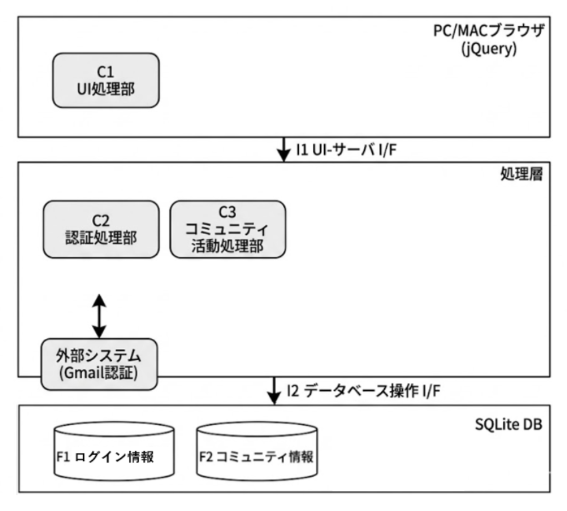
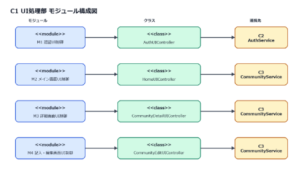
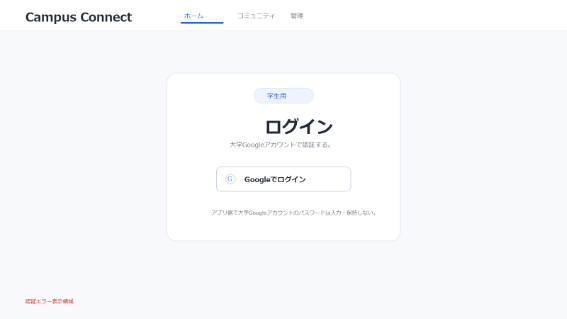
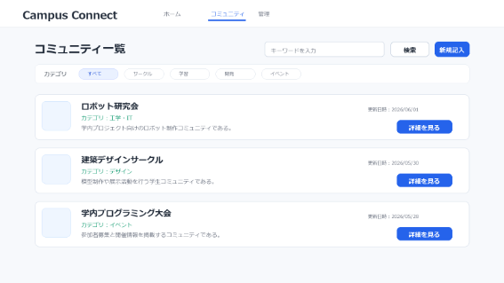
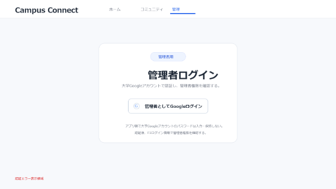
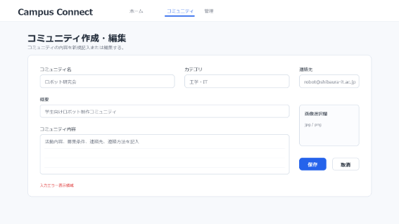
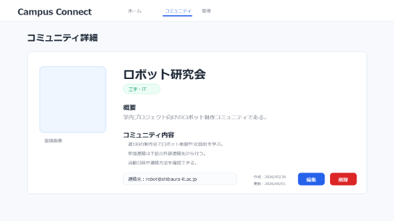
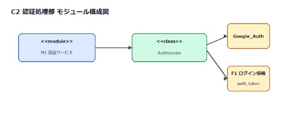
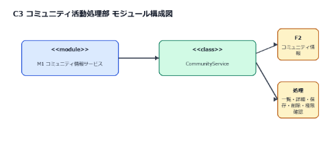

大学生のコミュニティ活動を促進するコミュニティアプリ

内部設計書

2026年5月31日

Ver.1.3

4班

代表者　name

連絡先(e-mail)  address

# 目次

1. 本設計書の位置づけと範囲
1. コンポーネント構成図
1. 画面一覧
1. 外部変数一覧
1. 各コンポーネントの内部仕様

添付1　 大学生のコミュニティ活動を促進するコミュニティアプリ 外部設計書 Ver.2.3

添付2　 大学生のコミュニティ活動を促進するコミュニティアプリ 要求仕様書 Ver.3.3

1. 本設計書の位置づけと範囲

本設計書は，「大学生のコミュニティ活動を促進するコミュニティアプリ」の内部設計事項を記述したものである。要求仕様書 Ver.3.3 および外部設計書 Ver.2.3 に基づき，C1 UI処理部，C2 認証処理部，C3 コミュニティ活動処理部をプログラム実装できる単位へ詳細化する。また，画面入力に対するエラー処理の内容を設計する。

1. コンポーネント構成図

   

1. 画面一覧

【GUIを利用する場合は以下のような画面名称一覧を作成すること】

【Webアプリの場合はファイル名（ページ名）を書くこと】

|**コンポーネント名**|**画面名称**|**プログラム上の画面名称**|**担当者**|
| - | - | - | - |
|C1 UI処理部|W1 ログイン画面|user\_login|Y|
||W2 メイン画面|home|Y|
|C1 UI処理部|W3 管理者用ログイン画面|admin\_login|Y|
|C1 UI処理部|W4 コミュニティ作成・編集画面|edit\_community|Y|
|C1 UI処理部|W5 コミュニティの詳細を表示する画面|detail\_community|Y|

1. 外部変数一覧

【外部変数を利用する場合は，以下のような一覧表を作成すること】

|**外部変数名**|**型**|**記述**|**利用範囲**|
| - | - | - | - |
|c\_time|時刻型|現在時刻を参照し，作成日時および更新日時の記録に用いる。|システム全体|
|Google\_Auth|JSON型|Google認証後に取得する認証情報である。メールアドレス，認証結果，必要に応じてGoogle側の識別情報を含む。C2認証処理部で検証し，メールアドレスが@shibaura-it.ac.jpである場合のみログインを許可する。|C1，C2|

1. 各コンポーネントの内部仕様

コンポーネント毎に，モジュール構成図，画面詳細とエラー処理，各モジュールの仕様を記載する．

C1　UI処理部

1) ` `モジュール構成図

UI処理部のモジュール構成を以下に示す。

C1 UI処理部は，画面種別ごとに以下のクラスで構成する。

図3.1.1 UI処理部モジュール構成図

|**モジュール名**|**クラス名**|**役割**|**連携先**|
| - | - | - | - |
|M1 認証UI制御|AuthUIController|W1およびW3のGoogle認証操作，認証結果送信，画面遷移を制御する。|C2 AuthService|
|M2 メイン画面UI制御|HomeUIController|W2の一覧表示，検索条件受付，詳細画面への遷移を制御する。|C3 CommunityService|
|M3 詳細画面UI制御|CommunityDetailUIController|W5の詳細表示，編集画面遷移，削除要求を制御する。|C3 CommunityService|
|M4 記入・編集画面UI制御|CommunityEditUIController|W4の新規記入・編集フォーム表示，保存要求を制御する。|C3 CommunityService|

表3.1.1 UI処理部モジュール・クラス対応表

1) 画面詳細とエラー処理

UI処理部に属する画面詳細を以下に示す．

W1 ログイン画面

概要：一般ユーザが大学Googleアカウントを用いてログインする画面である。

表示項目：システム名，Googleログインボタン，認証エラー表示。入力項目：Googleログインボタンの押下操作。パスワード入力欄は設けず，アプリ側で大学Googleアカウントのパスワードを保持・処理しない。

図3.1.2 W1 ログイン画面イメージ

W2 メイン画面

概要：登録済みコミュニティの一覧を表示し，条件指定で絞り込む画面である。表示項目：コミュニティ名，カテゴリ，概要，画像，更新日時，詳細リンク，新規記入ボタン。入力項目：検索キーワード，カテゴリ条件。

図3.1.3 W2 メイン画面イメージ

W3 管理者用ログイン画面

概要：管理者が大学Googleアカウントを用いてログインし，管理者権限を確認する画面である。表示項目：システム名，管理者用Googleログインボタン，認証エラー表示。入力項目：管理者用Googleログインボタンの押下操作。パスワード入力欄は設けない。Google認証後，C2認証処理部がF1ログイン情報を参照し，管理者権限の有無を確認する。

図3.1.4 W3 管理者用ログイン画面イメージ

W4 コミュニティ作成・編集画面

概要：コミュニティの内容を新規記入または編集する画面である。表示項目：入力フォーム，画像選択欄，保存ボタン，キャンセルボタン，入力エラー表示。入力項目：コミュニティ名，カテゴリ，概要，コミュニティ内容，画像。

図3.1.5 W4 コミュニティ作成・編集画面イメージ

W5 コミュニティの詳細を表示する画面

概要：選択したコミュニティの詳細情報を表示する画面である。表示項目：コミュニティ名，カテゴリ，概要，コミュニティ内容，画像，作成日時，更新日時，編集ボタン，削除ボタン。入力項目：コミュニティID，編集または削除の操作。

図3.1.6 W5 コミュニティの詳細を表示する画面イメージ

画面で生じる入力エラーを以下に示す。

|**No**|**入力エラーの内容**|**エラー処理**|
| - | - | - |
|E1|Google認証が開始できない。|「Google認証を開始できませんでした。再度ログインしてください。」と表示する。|
|E2|学内Googleアカウントではない。|「大学のGoogleアカウントでログインしてください。」と表示する。|
|E3|認証に失敗した。|ログイン画面に認証失敗メッセージを表示し，再度ログインを促す。|
|E4|コミュニティ名が未入力である。|W4に「コミュニティ名を入力してください。」と表示する。|
|E5|コミュニティ内容が未入力である。|W4に「コミュニティ内容を入力してください。」と表示する。|
|E6|入力文字数が上限を超えている。|上限超過項目を表示し，保存処理を行わない。|
|E7|権限のないコミュニティを編集または削除しようとした。|権限エラーを表示し，対象コミュニティを変更しない。|
|E8|対象コミュニティが存在しない。|対象なしのメッセージを表示し，W2メイン画面へ戻す。|
|E9|通信またはDB処理に失敗した。|処理失敗メッセージを表示し，必要に応じて再実行を促す。|

1) モジュール仕様

UI処理部を構成するクラス仕様を以下に示す。

入力元，出力先としては，引数，戻り値，画面，I/F，外部変数を記述する。

クラス名，クラス概要，メソッド名，機能概要，入力，出力，エラー処理を記述する。

AuthUIController

|コンポーネント名|C1　UI処理部|||
| - | - | :- | :- |
|モジュール名|M1 認証UI制御|担当者：Y||
|クラス名|AuthUIController|||
|クラス概要|ログイン画面および管理者用ログイン画面の表示，Google認証開始，C2への認証結果送信，認証結果に応じた画面遷移を行う。|||
||メソッド名|showLogin()||
||機能概要|W1ログイン画面を表示する。auth\_tokenが有効な場合はW2メイン画面へ遷移する。||
||入力|auth\_token（任意）||
||出力|W1ログイン画面，またはW2メイン画面||
||エラー処理|auth\_tokenが無効な場合はW1ログイン画面を表示する。||
||メソッド名|requestLogin()||
||機能概要|W1のGoogleログインボタン押下を受け取り，大学GoogleアカウントによるGoogle認証を開始する。||
||入力|Googleログインボタンの押下操作||
||出力|Google認証画面への遷移，または認証開始失敗メッセージ||
||エラー処理|E1，E9||
||メソッド名|handleGoogleAuthResult()||
||機能概要|Google認証後に取得したGoogle\_AuthをC2 AuthServiceへ送信し，認証結果を受け取る。認証成功時はauth\_tokenを保存しW2へ遷移し，認証失敗時はW1にエラーメッセージを表示する。||
||入力|Google\_Auth||
||出力|auth\_token，W2メイン画面，またはW1エラーメッセージ||
||エラー処理|E2，E3，E9||
||メソッド名|requestAdminLogin()||
||機能概要|W3の管理者用Googleログインボタン押下を受け取り，Google認証結果をC2 AuthServiceへ送信する。C2で管理者権限が確認できた場合のみ，管理者権限付きのauth\_tokenを保存しW2へ遷移する。||
||入力|管理者用Googleログインボタンの押下操作，Google\_Auth||
||出力|管理者権限付きauth\_token，W2メイン画面，またはW3エラーメッセージ||
||エラー処理|E1，E2，E3，E9||

HomeUIController

|コンポーネント名|C1　UI処理部|||
| - | - | :- | :- |
|モジュール名|M2 メイン画面UI制御|担当者：Y||
|クラス名|HomeUIController|||
|クラス概要|メイン画面におけるコミュニティ一覧表示，検索条件受付，詳細画面への遷移を行う。|||
||メソッド名|showHome()||
||機能概要|C3からコミュニティ一覧を取得し，W2メイン画面へ表示する。||
||入力|auth\_token||
||出力|W2メイン画面，コミュニティ一覧||
||エラー処理|E9||
||メソッド名|searchCommunities()||
||機能概要|入力された条件に一致するコミュニティをC3へ問い合わせ，W2の一覧を更新する。||
||入力|検索キーワード，カテゴリ条件||
||出力|条件に一致するコミュニティ一覧||
||エラー処理|E9。該当なしの場合は対象なしメッセージを表示する。||

CommunityDetailUIController

|コンポーネント名|C1　UI処理部|||
| - | - | :- | :- |
|モジュール名|M3 詳細画面UI制御|担当者：Y||
|クラス名|CommunityDetailUIController|||
|クラス概要|コミュニティ詳細画面の表示，編集画面への遷移，削除要求の受付を行う。|||
||メソッド名|showCommunityDetail()||
||機能概要|C3から指定コミュニティの詳細情報を取得し，W5に表示する。||
||入力|コミュニティID，auth\_token||
||出力|W5コミュニティ詳細画面||
||エラー処理|E8，E9||
||メソッド名|requestDeleteCommunity()||
||機能概要|W5の削除操作を受け付け，C3へ削除要求を送信する。||
||入力|コミュニティID，auth\_token||
||出力|削除完了メッセージ，W2メイン画面||
||エラー処理|E7，E8，E9||

CommunityEditUIController

|コンポーネント名|C1　UI処理部|||
| - | - | :- | :- |
|モジュール名|M4 記入・編集画面UI制御|担当者：Y||
|クラス名|CommunityEditUIController|||
|クラス概要|W4の新規記入フォーム，編集フォーム，保存要求を制御する。|||
||メソッド名|showCreateForm()||
||機能概要|W4コミュニティ作成・編集画面を新規記入状態で表示する。||
||入力|auth\_token||
||出力|W4コミュニティ作成・編集画面||
||エラー処理|認証状態が確認できない場合はW1へ戻す。||
||メソッド名|showEditForm()||
||機能概要|C3から既存情報を取得し，W4を編集状態で表示する。||
||入力|コミュニティID，auth\_token||
||出力|既存情報を反映したW4コミュニティ作成・編集画面||
||エラー処理|E7，E8，E9||
||メソッド名|saveCommunity()||
||機能概要|W4の入力内容を検証し，C3へ保存要求を送信する。||
||入力|コミュニティ名，カテゴリ，概要，コミュニティ内容，画像，auth\_token||
||出力|保存完了メッセージ，登録または更新されたコミュニティID||
||エラー処理|E4，E5，E6，E7，E8，E9||

C2　認証処理部

モジュール構成図

認証処理部のモジュール構成を以下に示す。

図3.2.1 認証処理部モジュール構成図

|**モジュール名**|**クラス名**|**役割**|
| - | - | - |
|M1 認証サービス|AuthService|大学GoogleアカウントのGoogle認証情報を検証し，メールアドレスが@shibaura-it.ac.jpであることを確認する。認証後，管理者権限確認とログイントークン発行を行う。|

表3.2.1 認証処理部モジュール・クラス対応表

モジュール仕様

AuthService

|コンポーネント名|C2　認証処理部|||
| - | - | :- | :- |
|モジュール名|M1 認証サービス|担当者：T||
|クラス名|AuthService|||
|クラス概要|C1から受け取ったGoogle認証情報を検証し，認証後に取得したメールアドレスが@shibaura-it.ac.jpであること，一般ユーザとしてログイン可能かを判定し，必要に応じて管理者権限確認を行う。|||
||メソッド名|verifyGoogleAccount()||
||機能概要|C1から受け取ったGoogle\_Authを検証し，Google認証が成功していることを確認する。認証後に取得したメールアドレスが@shibaura-it.ac.jpである場合は認証結果OK，ユーザID，メールアドレスを返し，条件を満たさない場合は認証結果NGを返す。||
||入力|Google\_Auth||
||出力|認証結果OK/NG，ユーザID，メールアドレス||
||エラー処理|E2，E3，E9||
||メソッド名|verifyAdminRole()||
||機能概要|F1ログイン情報を参照し，認証済みユーザが管理者権限を持つか確認する。||
||入力|ユーザID，メールアドレス，F1ログイン情報||
||出力|管理者認証結果OK/NG，権限種別||
||エラー処理|E3，E9||
||メソッド名|issueLoginToken()||
||機能概要|認証済みユーザに対して，本システム内で利用するauth\_tokenを発行する。||
||入力|ユーザID，権限種別，c\_time||
||出力|auth\_token，有効期限，F1ログイン情報の更新結果||
||エラー処理|E9||

C3　コミュニティ活動処理部

モジュール構成図

コミュニティ活動処理部のモジュール構成を以下に示す。

図3.3.1 コミュニティ活動処理部モジュール構成図

|**モジュール名**|**クラス名**|**役割**|
| - | - | - |
|M1 コミュニティ情報サービス|CommunityService|F2 コミュニティ情報を参照し，一覧取得，詳細取得，新規記入・編集内容の保存，削除，権限確認を行う。|

表3.3.1 コミュニティ活動処理部モジュール・クラス対応表

モジュール仕様

CommunityService

|コンポーネント名|C3　コミュニティ活動処理部|||
| - | - | :- | :- |
|モジュール名|M1 コミュニティ情報サービス|担当者：K||
|クラス名|CommunityService|||
|クラス概要|F2コミュニティ情報を管理し，C1からの要求に応じてコミュニティ情報の取得，新規記入内容の保存，編集内容の保存，削除を行う。|||
||メソッド名|getCommunityList()||
||機能概要|検索条件に一致する公開中のコミュニティ情報をF2から取得する。auth\_tokenから利用者を識別し，編集・削除ボタンの表示可否を判定する。条件がない場合は既定条件で取得する。||
||入力|検索キーワード，カテゴリ条件，auth\_token||
||出力|コミュニティID，コミュニティ名，カテゴリ，概要，画像保存パス，更新日時の一覧||
||エラー処理|E9||
||メソッド名|getCommunityDetail()||
||機能概要|指定されたコミュニティIDの詳細情報をF2から取得する。||
||入力|コミュニティID||
||出力|コミュニティ名，カテゴリ，概要，コミュニティ内容，画像保存パス，作成日時，更新日時，公開状態||
||エラー処理|E8，E9||
||メソッド名|saveCommunity()||
||機能概要|W4の入力内容を検証し，F2へ新規記入または編集内容として保存する。編集時は権限を確認する。||
||入力|コミュニティ編集情報，auth\_token，c\_time||
||出力|保存結果OK/NG，コミュニティID，保存完了メッセージ||
||エラー処理|E4，E5，E6，E7，E8，E9||
||メソッド名|deleteCommunity()||
||機能概要|権限確認後，対象コミュニティの公開状態を削除に更新する。||
||入力|コミュニティID，auth\_token，c\_time||
||出力|削除結果OK/NG，削除完了メッセージ||
||エラー処理|E7，E8，E9||
||メソッド名|checkCommunityPermission()||
||機能概要|一般ユーザは自分が新規記入したコミュニティのみ，システム管理者は全コミュニティを編集または削除できるよう判定する。||
||入力|コミュニティID，ユーザID，権限種別（auth\_tokenから取得）||
||出力|権限判定OK/NG||
||エラー処理|E8，E9||

改訂履歴

|バージョン|改訂日|改訂内容|
| :-: | :-: | :-: |
|1\.0|2026\.05.31|初版発行|
|1\.1|2026\.05.31|要求仕様書・外部設計書に合わせて内部仕様を更新|
|1\.2|2026\.06.01|認証方式を大学GoogleアカウントによるGoogle認証に統一|
|1\.3|2026\.06.01|要求仕様書 Ver.3.3 および外部設計書 Ver.2.3 に合わせ，データフロー・版数参照・auth\_token利用を修正|
||||

添付1　 大学生のコミュニティ活動を促進するコミュニティアプリ 外部設計書 Ver.2.3

添付2　 大学生のコミュニティ活動を促進するコミュニティアプリ 要求仕様書 Ver.3.3

16

