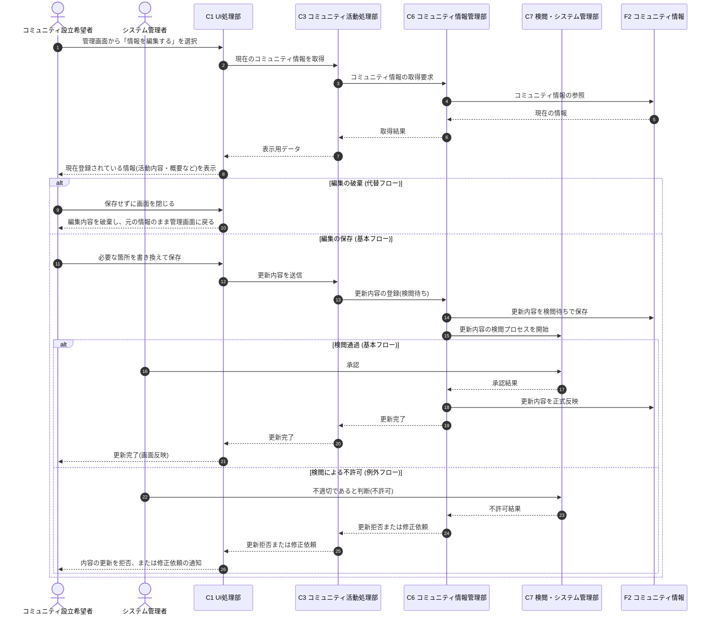

```mermaid
sequenceDiagram
    autonumber
    actor Creator as コミュニティ設立希望者
    actor Admin as システム管理者
    participant C1 as C1 UI処理部
    participant C3 as C3 コミュニティ活動処理部
    participant C6 as C6 コミュニティ情報管理部
    participant C7 as C7 検閲・システム管理部
    participant F2 as F2 コミュニティ情報

    Creator->>C1: 管理画面から「情報を編集する」を選択
    C1->>C3: 現在のコミュニティ情報を取得
    C3->>C6: コミュニティ情報の取得要求
    C6->>F2: コミュニティ情報の参照
    F2-->>C6: 現在の情報
    C6-->>C3: 取得結果
    C3-->>C1: 表示用データ
    C1-->>Creator: 現在登録されている情報(活動内容・概要など)を表示
    
    alt 編集の破棄 (代替フロー)
        Creator->>C1: 保存せずに画面を閉じる
        C1-->>Creator: 編集内容を破棄し、元の情報のまま管理画面に戻る
    else 編集の保存 (基本フロー)
        Creator->>C1: 必要な箇所を書き換えて保存
        C1->>C3: 更新内容を送信
        C3->>C6: 更新内容の登録(検閲待ち)
        C6->>F2: 更新内容を検閲待ちで保存
        C6->>C7: 更新内容の検閲プロセスを開始
        
        alt 検閲通過 (基本フロー)
            Admin->>C7: 承認
            C7-->>C6: 承認結果
            C6->>F2: 更新内容を正式反映
            C6-->>C3: 更新完了
            C3-->>C1: 更新完了
            C1-->>Creator: 更新完了(画面反映)
        else 検閲による不許可 (例外フロー)
            Admin->>C7: 不適切であると判断(不許可)
            C7-->>C6: 不許可結果
            C6-->>C3: 更新拒否または修正依頼
            C3-->>C1: 更新拒否または修正依頼
            C1-->>Creator: 内容の更新を拒否、または修正依頼の通知
        end
    end
```