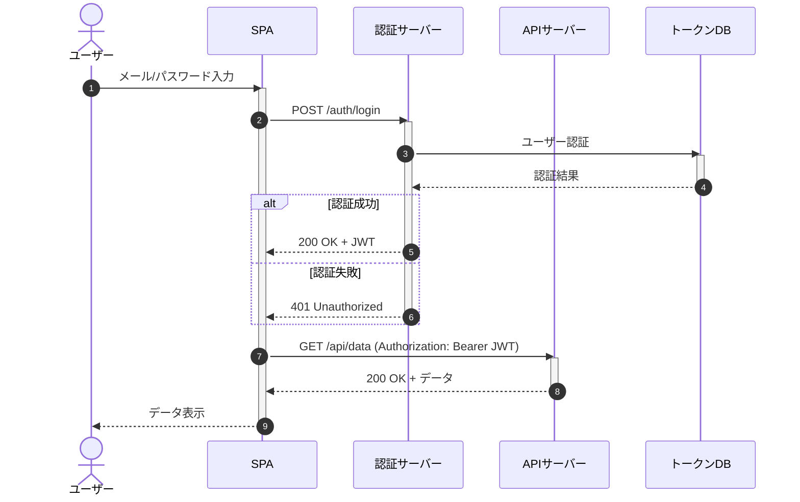

```mermaid
sequenceDiagram
    autonumber

    actor userActor as ユーザー
    participant clientApp as SPA
    participant authServer as 認証サーバー
    participant apiServer as APIサーバー
    participant tokenDb as トークンDB

    userActor->>clientApp: メール/パスワード入力

    activate clientApp
    clientApp->>authServer: POST /auth/login

    activate authServer
    authServer->>tokenDb: ユーザー認証

    activate tokenDb
    tokenDb-->>authServer: 認証結果
    deactivate tokenDb

    alt 認証成功
        authServer-->>clientApp: 200 OK + JWT
    else 認証失敗
        authServer-->>clientApp: 401 Unauthorized
    end

    deactivate authServer

    clientApp->>apiServer: GET /api/data (Authorization: Bearer JWT)

    activate apiServer
    apiServer-->>clientApp: 200 OK + データ
    deactivate apiServer

    clientApp-->>userActor: データ表示
    deactivate clientApp
```