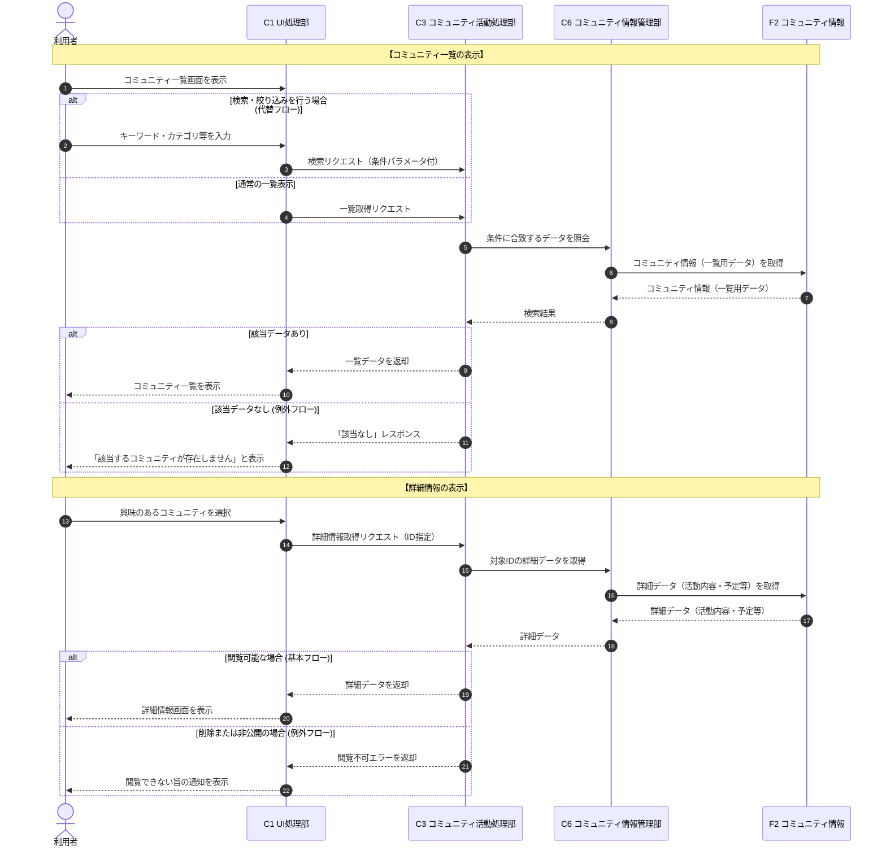

```mermaid
sequenceDiagram
    autonumber
    actor User as 利用者
    participant C1 as C1 UI処理部
    participant C3 as C3 コミュニティ活動処理部
    participant C6 as C6 コミュニティ情報管理部
    participant F2 as F2 コミュニティ情報

    Note over User, F2: 【コミュニティ一覧の表示】
    User->>C1: コミュニティ一覧画面を表示
    
    alt 検索・絞り込みを行う場合 (代替フロー)
        User->>C1: キーワード・カテゴリ等を入力
        C1->>C3: 検索リクエスト（条件パラメータ付）
    else 通常の一覧表示
        C1->>C3: 一覧取得リクエスト
    end

    C3->>C6: 条件に合致するデータを照会
    C6->>F2: コミュニティ情報（一覧用データ）を取得
    F2-->>C6: コミュニティ情報（一覧用データ）
    C6-->>C3: 検索結果

    alt 該当データあり
        C3-->>C1: 一覧データを返却
        C1-->>User: コミュニティ一覧を表示
    else 該当データなし (例外フロー)
        C3-->>C1: 「該当なし」レスポンス
        C1-->>User: 「該当するコミュニティが存在しません」と表示
    end

    Note over User, F2: 【詳細情報の表示】
    User->>C1: 興味のあるコミュニティを選択
    C1->>C3: 詳細情報取得リクエスト（ID指定）
    C3->>C6: 対象IDの詳細データを取得
    C6->>F2: 詳細データ（活動内容・予定等）を取得
    F2-->>C6: 詳細データ（活動内容・予定等）
    C6-->>C3: 詳細データ

    alt 閲覧可能な場合 (基本フロー)
        C3-->>C1: 詳細データを返却
        C1-->>User: 詳細情報画面を表示
    else 削除または非公開の場合 (例外フロー)
        C3-->>C1: 閲覧不可エラーを返却
        C1-->>User: 閲覧できない旨の通知を表示
    end
```