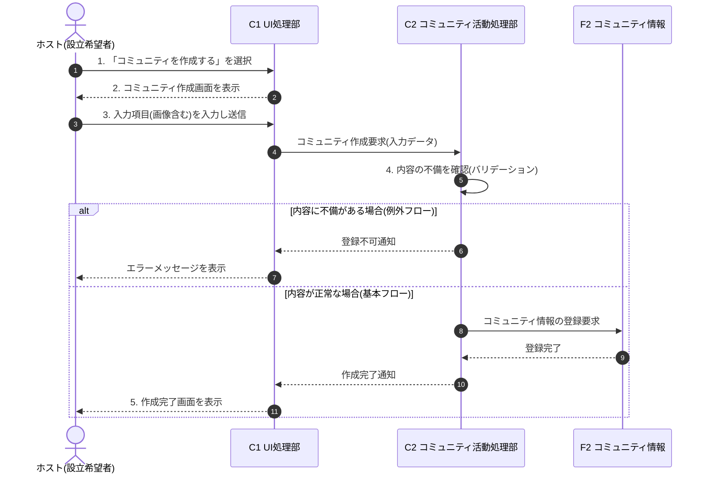

# コミュニティ作成シーケンス図

```mermaid
sequenceDiagram
    autonumber
    actor Host as ホスト(設立希望者)
    participant UI as C1 UI処理部
    participant Logic as C2 コミュニティ活動処理部
    participant DB as F2 コミュニティ情報

    Host->>UI: 1. 「コミュニティを作成する」を選択
    UI-->>Host: 2. コミュニティ作成画面を表示
    Host->>UI: 3. 入力項目(画像含む)を入力し送信
    UI->>Logic: コミュニティ作成要求(入力データ)
    Logic->>Logic: 4. 内容の不備を確認(バリデーション)
    
    alt 内容に不備がある場合(例外フロー)        
        Logic-->>UI: 登録不可通知
        UI-->>Host: エラーメッセージを表示
    else 内容が正常な場合(基本フロー)
        Logic->>DB: コミュニティ情報の登録要求
        DB-->>Logic: 登録完了
        Logic-->>UI: 作成完了通知
        UI-->>Host: 5. 作成完了画面を表示
    end
```