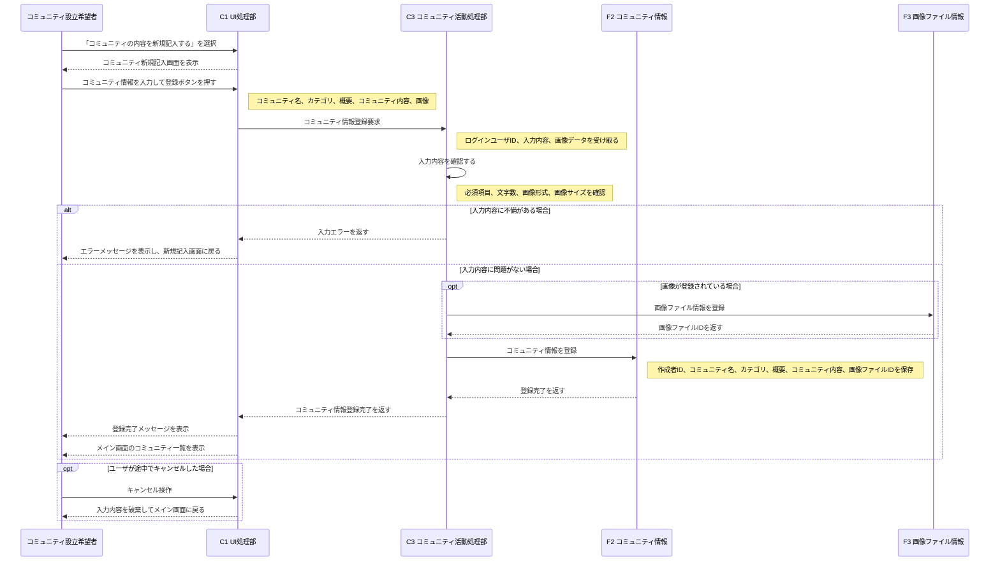

```mermaid
sequenceDiagram

    participant User as コミュニティ設立希望者
    participant C1 as C1 UI処理部
    participant C3 as C3 コミュニティ活動処理部
    participant F2 as F2 コミュニティ情報
    participant F3 as F3 画像ファイル情報

    User->>C1: 「コミュニティの内容を新規記入する」を選択
    C1-->>User: コミュニティ新規記入画面を表示

    User->>C1: コミュニティ情報を入力して登録ボタンを押す
    Note right of C1: コミュニティ名、カテゴリ、概要、コミュニティ内容、画像

    C1->>C3: コミュニティ情報登録要求
    Note right of C3: ログインユーザID、入力内容、画像データを受け取る

    C3->>C3: 入力内容を確認する
    Note right of C3: 必須項目、文字数、画像形式、画像サイズを確認

    alt 入力内容に不備がある場合
        C3-->>C1: 入力エラーを返す
        C1-->>User: エラーメッセージを表示し、新規記入画面に戻る
    else 入力内容に問題がない場合
        opt 画像が登録されている場合
            C3->>F3: 画像ファイル情報を登録
            F3-->>C3: 画像ファイルIDを返す
        end

        C3->>F2: コミュニティ情報を登録
        Note right of F2: 作成者ID、コミュニティ名、カテゴリ、概要、コミュニティ内容、画像ファイルIDを保存
        F2-->>C3: 登録完了を返す

        C3-->>C1: コミュニティ情報登録完了を返す
        C1-->>User: 登録完了メッセージを表示
        C1-->>User: メイン画面のコミュニティ一覧を表示
    end

    opt ユーザが途中でキャンセルした場合
        User->>C1: キャンセル操作
        C1-->>User: 入力内容を破棄してメイン画面に戻る
    end
```