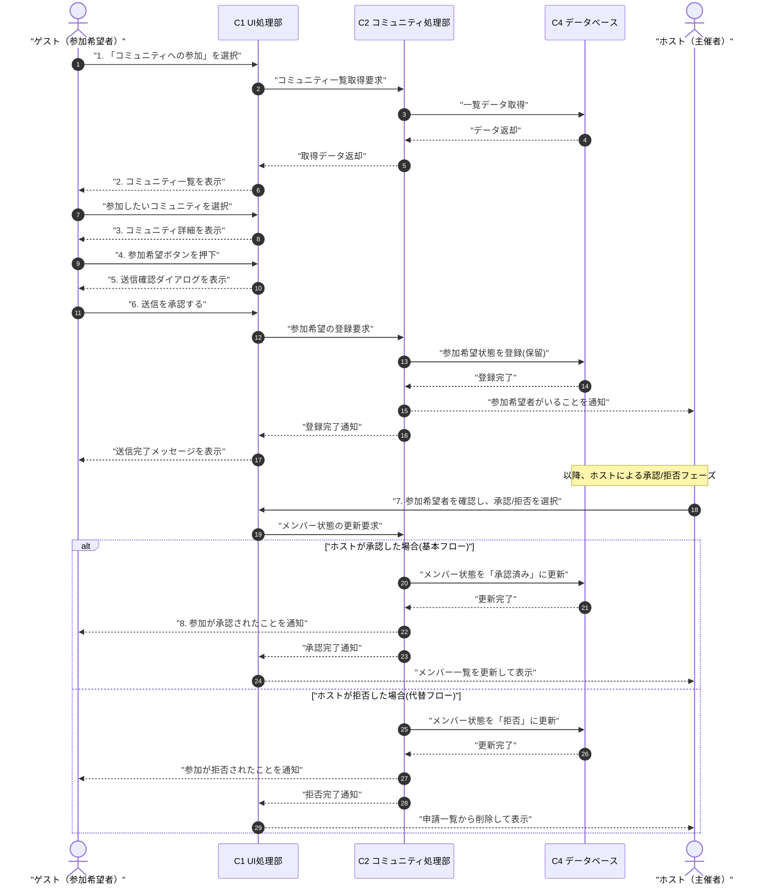

# コミュニティ参加シーケンス

```mermaid
sequenceDiagram
    autonumber
    actor Guest as "ゲスト（参加希望者）"
    participant UI as C1 UI処理部
    participant Logic as C2 コミュニティ処理部
    participant DB as C4 データベース
    actor Host as "ホスト（主催者）"

    Guest->>UI: "1. 「コミュニティへの参加」を選択"
    UI->>Logic: "コミュニティ一覧取得要求"
    Logic->>DB: "一覧データ取得"
    DB-->>Logic: "データ返却"
    Logic-->>UI: "取得データ返却"
    UI-->>Guest: "2. コミュニティ一覧を表示"
    Guest->>UI: "参加したいコミュニティを選択"
    UI-->>Guest: "3. コミュニティ詳細を表示"
    Guest->>UI: "4. 参加希望ボタンを押下"
    UI-->>Guest: "5. 送信確認ダイアログを表示"
    Guest->>UI: "6. 送信を承認する"
    UI->>Logic: "参加希望の登録要求"
    Logic->>DB: "参加希望状態を登録(保留)"
    DB-->>Logic: "登録完了"
    Logic-->>Host: "参加希望者がいることを通知"
    Logic-->>UI: "登録完了通知"
    UI-->>Guest: "送信完了メッセージを表示"
    
    Note over Host, DB: 以降、ホストによる承認/拒否フェーズ

    Host->>UI: "7. 参加希望者を確認し、承認/拒否を選択"
    UI->>Logic: "メンバー状態の更新要求"
    
    alt "ホストが承認した場合(基本フロー)"
        Logic->>DB: "メンバー状態を「承認済み」に更新"
        DB-->>Logic: "更新完了"
        Logic-->>Guest: "8. 参加が承認されたことを通知"
        Logic-->>UI: "承認完了通知"
        UI-->>Host: "メンバー一覧を更新して表示"
    else "ホストが拒否した場合(代替フロー)"
        Logic->>DB: "メンバー状態を「拒否」に更新"
        DB-->>Logic: "更新完了"
        Logic-->>Guest: "参加が拒否されたことを通知"
        Logic-->>UI: "拒否完了通知"
        UI-->>Host: "申請一覧から削除して表示"
    end
```