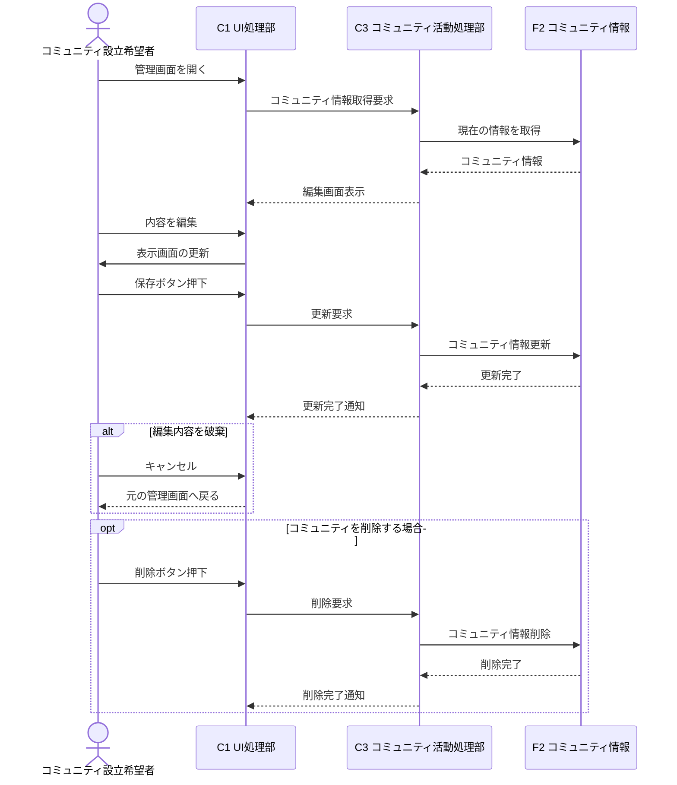

```mermaid
sequenceDiagram
    actor 主催者 as コミュニティ設立希望者
    participant UI as C1 UI処理部
    participant System as C3 コミュニティ活動処理部
    participant DB as F2 コミュニティ情報


    主催者->>UI: 管理画面を開く
    UI->>System: コミュニティ情報取得要求
    System->>DB: 現在の情報を取得
    DB-->>System: コミュニティ情報
    System-->>UI: 編集画面表示

    主催者->>UI: 内容を編集
    UI->>主催者: 表示画面の更新

    主催者->>UI: 保存ボタン押下
    UI->>System: 更新要求
    System->>DB: コミュニティ情報更新
    DB-->>System: 更新完了
    System-->>UI: 更新完了通知


    alt 編集内容を破棄
        主催者->>UI: キャンセル
        UI-->>主催者: 元の管理画面へ戻る
    end

    opt コミュニティを削除する場合
        主催者->>UI: 削除ボタン押下
        UI->>System: 削除要求
        System->>DB: コミュニティ情報削除
        DB-->>System: 削除完了
        System-->>UI: 削除完了通知
    end
```