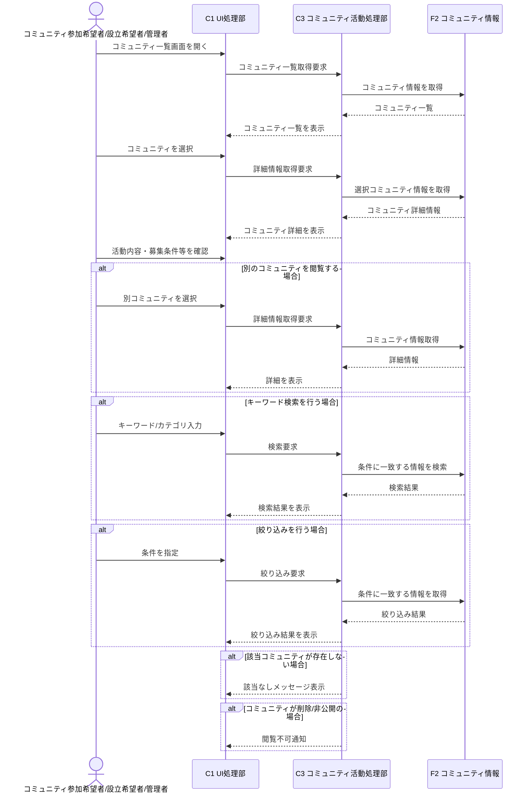

# コミュニティ情報の閲覧 シーケンス図

```mermaid
sequenceDiagram
    actor 利用者 as コミュニティ参加希望者/設立希望者/管理者
    participant UI as C1 UI処理部
    participant System as C3 コミュニティ活動処理部
    participant DB as F2 コミュニティ情報


    利用者->>UI: コミュニティ一覧画面を開く
    UI->>System: コミュニティ一覧取得要求
    System->>DB: コミュニティ情報を取得
    DB-->>System: コミュニティ一覧
    System-->>UI: コミュニティ一覧を表示

    利用者->>UI: コミュニティを選択
    UI->>System: 詳細情報取得要求
    System->>DB: 選択コミュニティ情報を取得
    DB-->>System: コミュニティ詳細情報
    System-->>UI: コミュニティ詳細を表示

    利用者->>UI: 活動内容・募集条件等を確認

    alt 別のコミュニティを閲覧する場合
        利用者->>UI: 別コミュニティを選択
        UI->>System: 詳細情報取得要求
        System->>DB: コミュニティ情報取得
        DB-->>System: 詳細情報
        System-->>UI: 詳細を表示
    end

    alt キーワード検索を行う場合
        利用者->>UI: キーワード/カテゴリ入力
        UI->>System: 検索要求
        System->>DB: 条件に一致する情報を検索
        DB-->>System: 検索結果
        System-->>UI: 検索結果を表示
    end

    alt 絞り込みを行う場合
        利用者->>UI: 条件を指定
        UI->>System: 絞り込み要求
        System->>DB: 条件に一致する情報を取得
        DB-->>System: 絞り込み結果
        System-->>UI: 絞り込み結果を表示
    end

    alt 該当コミュニティが存在しない場合
        System-->>UI: 該当なしメッセージ表示
    end

    alt コミュニティが削除/非公開の場合
        System-->>UI: 閲覧不可通知
    end
```